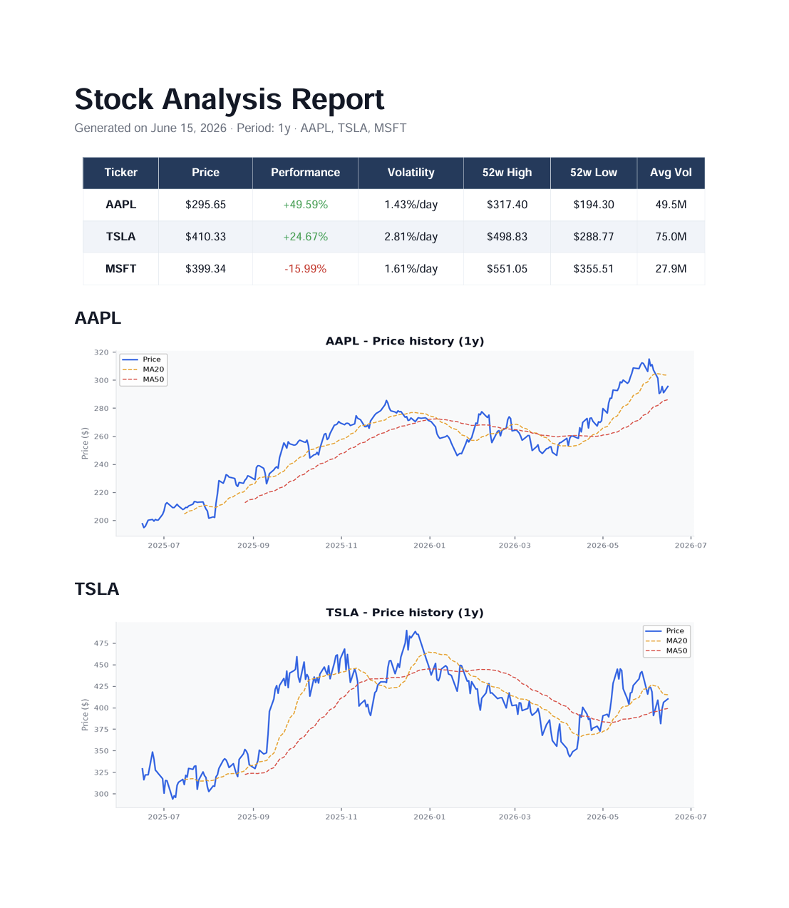

# 📊 Stock Report PDF Generator

A Python tool that automatically generates a professional PDF report comparing multiple stocks, using real market data fetched from Yahoo Finance.



---

## ✨ Features

- **Multi-stock comparison** in a single PDF
- **Summary table** with performance, volatility, 52w high/low, and average volume
- **Price charts** with 20-day and 50-day moving averages per stock
- **Color-coded performance** — green for gains, red for losses
- **Auto-dated filename** — e.g. `report_AAPL_TSLA_MSFT_20260615.pdf`
- Fully configurable via CLI — any stock, any combination

---

## 🚀 Quick Start

```bash
# Install dependencies
pip install yfinance pandas matplotlib reportlab

# Generate a report for Apple, Tesla and Microsoft
python report.py AAPL TSLA MSFT

# Any combination works
python report.py NVDA META GOOGL AMZN
```

---

## 📄 Output

The script generates a clean, print-ready PDF containing:

1. A **summary table** comparing all requested stocks at a glance
2. One **price history chart** per stock with moving averages overlaid

---

## 🛠️ Built With

- [yfinance](https://github.com/ranaroussi/yfinance) — Yahoo Finance market data
- [Pandas](https://pandas.pydata.org/) — data manipulation
- [Matplotlib](https://matplotlib.org/) — chart generation
- [ReportLab](https://www.reportlab.com/) — PDF generation

---

## 💡 Example Output

| Ticker | Price    | Performance | Volatility  | 52w High |
|--------|----------|-------------|-------------|----------|
| AAPL   | $295.65  | +49.59%     | 1.43%/day   | $317.40  |
| TSLA   | $410.33  | +24.67%     | 2.81%/day   | $498.83  |
| MSFT   | $399.34  | -15.99%     | 1.61%/day   | $551.05  |
